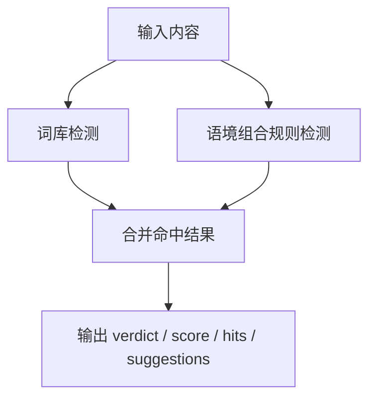

# 当前语境规则覆盖说明

这份文档只回答一个问题：

`目前内容检测链路里，哪些语境是会被自动检测到的，哪些还没有被自动覆盖？`

---

## 一句话结论

当前不是只有“表面敏感词检测”。

系统已经有一层 `语境组合规则`，会判断一些词是否成组出现。

但它仍然是：

`规则型语境检测`

不是：

`强语义理解型检测`

也就是说，目前更像：

1. 先看词库命中
2. 再看几个重点风险语境是否组合出现

---

## 1. 当前检测链路结构

对应代码：

- 词库检测：[src/analyzer.js](/Users/taptaq/Documents/RedLine%20Lens/src/analyzer.js:13)
- 语境规则入口：[src/analyzer.js](/Users/taptaq/Documents/RedLine%20Lens/src/analyzer.js:80)
- 语境规则定义：[src/risk-rules.js](/Users/taptaq/Documents/RedLine%20Lens/src/risk-rules.js:1)

---

## 2. 当前已经自动检测的语境

## 2.1 未成年人边界

### 触发逻辑

同时出现：

- 未成年人线索
- 亲密 / 性相关表达

### 当前关键词

- 未成年人线索：
  - `未成年`
  - `18岁以下`
  - `小学生`
  - `初中生`
  - `高中生`
  - `学生情侣`
- 亲密敏感表达：
  - `两性`
  - `性`
  - `亲密`
  - `自我愉悦`
  - `身体探索`
  - `敏感`

### 当前判定

- `hard_block`

### 说明

这是目前最明确的一类语境规则。

不是看单个词，而是看：

`未成年人 + 敏感亲密表达`

是否同时存在。

---

## 2.2 导流与私域

### 触发逻辑

同时出现：

- 联系方式 / 私域接触词
- 转化 / 获取 / 下单意图词

### 当前关键词

- 联系方式类：
  - `微信`
  - `vx`
  - `二维码`
  - `私信`
  - `小窗`
  - `联系`
- 转化类：
  - `加我`
  - `主页`
  - `获取`
  - `完整版`
  - `咨询`
  - `下单`
  - `购买`
  - `链接`

### 当前判定

- `hard_block`

### 说明

这已经是明显的“语境检测”，不是单词检测。

例如只出现“微信”不一定触发，但：

- `微信 + 完整版`
- `私信 + 获取`
- `联系 + 下单`

这种组合会触发。

---

## 2.3 步骤化敏感内容

### 触发逻辑

同时出现：

- 教程 / 步骤类词
- 亲密敏感表达
- 身体 / 私密部位词

### 当前关键词

- 教程类：
  - `教程`
  - `步骤`
  - `实操`
  - `怎么做`
  - `完整流程`
  - `亲测过程`
- 亲密敏感表达：
  - `两性`
  - `性`
  - `亲密`
  - `自我愉悦`
  - `身体探索`
  - `敏感`
- 身体部位类：
  - `敏感部位`
  - `私密`
  - `身体`
  - `器官`

### 当前判定

- `manual_review`

### 说明

这是在拦：

`教程化 + 敏感主题 + 身体部位`

这种更危险的组合。

---

## 2.4 绝对化与功效承诺

### 触发逻辑

同时出现：

- 功效 / 承诺类词
- 亲密敏感表达

### 当前关键词

- 功效承诺类：
  - `最好`
  - `最佳`
  - `永久`
  - `根治`
  - `见效`
  - `安全`
  - `修复`
  - `治疗`
- 亲密敏感表达：
  - `两性`
  - `性`
  - `亲密`
  - `自我愉悦`
  - `身体探索`
  - `敏感`

### 当前判定

- `manual_review`

### 说明

这是在抓：

`敏感话题 + 疗效/承诺`

例如偏夸大、偏功效承诺的表达。

---

## 2.5 教育语境

### 触发逻辑

当内容出现教育 / 科普 / 关系沟通类词，且前面没有命中高风险规则时，会补一个相对正向的语境判断。

### 当前关键词

- `科普`
- `教育`
- `边界`
- `同意`
- `沟通`
- `心理`
- `健康`

### 当前判定

- `observe`

### 说明

这类规则不是为了拦截，而是为了告诉系统：

`这段内容可能更偏教育语境`

但它不是白名单放行，只是较弱的正向信号。

---

## 3. 当前没有强自动检测、但业务上很重要的语境

下面这些你这个项目其实很需要，但目前内容检测链路里还没有“强规则化覆盖”。

## 3.1 两性用品宣传 / 展示语境

### 现状

- 在“违规原因回流”里已经有对应语境模板
- 但在“内容检测主链路”里，还没有同等强度的自动语境规则

### 结果

可能会出现：

- 回流链路觉得这是重点语境
- 但内容检测链路当场不一定能自动打出来

### 建议优先级

- `高`

---

## 3.2 低俗挑逗 / 擦边演绎语境

### 现状

- 回流侧已有分类和语境候选模板
- 主检测链路里缺少比较明确的组合规则

### 结果

如果内容没有明显敏感词，但整体表达很擦边，当前规则可能不够稳。

### 建议优先级

- `高`

---

## 3.3 场景化交易导向

### 现状

导流规则目前更偏：

- 联系方式词
- 转化词

但还没覆盖很多更隐性的交易场景，比如：

- “想要的来”
- “懂的都懂”
- “主页看”
- “小窗告诉你”
- “进群拿”

### 建议优先级

- `高`

---

## 3.4 隐晦代称 / 黑话语境

### 现状

当前规则更适合抓显式表达。

如果用户大量使用：

- 缩写
- 谐音
- 黑话
- 变体表达

那命中效果会下降。

### 建议优先级

- `中高`

---

## 3.5 标题党 / 强刺激点击诱导

### 现状

主链路有建议文案会提醒这个问题，
但检测规则本身对“标题刺激性”还没有独立组合规则。

### 建议优先级

- `中`

---

## 3.6 人设化诱导语境

例如：

- “姐姐教你”
- “男友都扛不住”
- “对象看了直接...”

这类内容可能未必有明显敏感词，但语境上已经很偏刺激和引导。

### 建议优先级

- `中`

---

## 4. 当前系统到底属于哪一档

如果粗分三档：

### 第 1 档：只有表面敏感词检测

- 只看单词
- 不看组合

### 第 2 档：规则型语境检测

- 看关键词组合
- 看部分风险场景
- 还不是真正深层语义理解

### 第 3 档：强语义检测

- 能理解隐喻
- 能理解上下文
- 能处理复杂变体和擦边表达

你现在这个项目更接近：

`第 2 档：规则型语境检测`

不是第 1 档，但也还没到第 3 档。

---

## 5. 当前最准确的描述

你现在的内容检测链路，应该这样描述：

`词库命中 + 组合语境规则检测 + 较弱的教育语境识别`

而不是：

- 纯敏感词表面检测

也不是：

- 大模型级别的深层语义理解检测

---

## 6. 如果要继续增强，我建议的优先级

### 第一优先级

- 把 `两性用品宣传 / 展示语境` 正式补进主检测链路
- 把 `低俗挑逗 / 擦边演绎语境` 正式补进主检测链路
- 把更隐性的 `导流交易语境` 补强

### 第二优先级

- 补黑话 / 缩写 / 变体表达
- 补更细的标题党与刺激性封面规则

### 第三优先级

- 引入“规则 + 模型复判”的在线混合检测
- 让主检测链路也具备更强的语义判断能力

---

## 7. 最后一句话总结

当前已经有语境自动检测，

但它主要是：

`基于关键词组合的规则型语境检测`

现在的短板不在“完全没有语境”，

而在：

`语境规则覆盖还不够全，尤其是两性用品展示、擦边演绎、隐晦导流这几类。`
