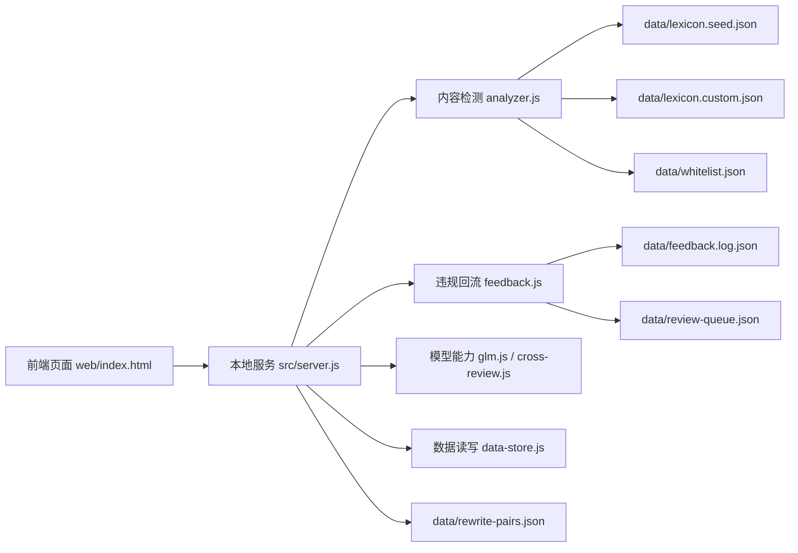
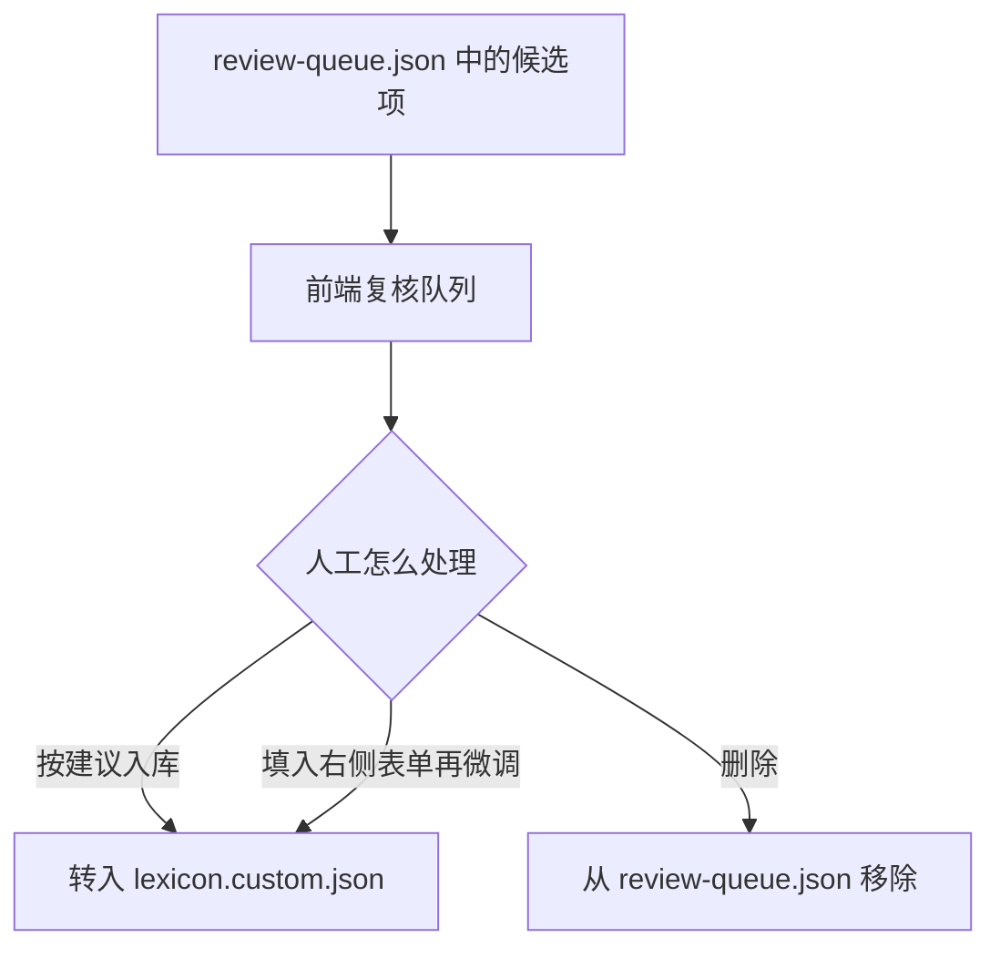
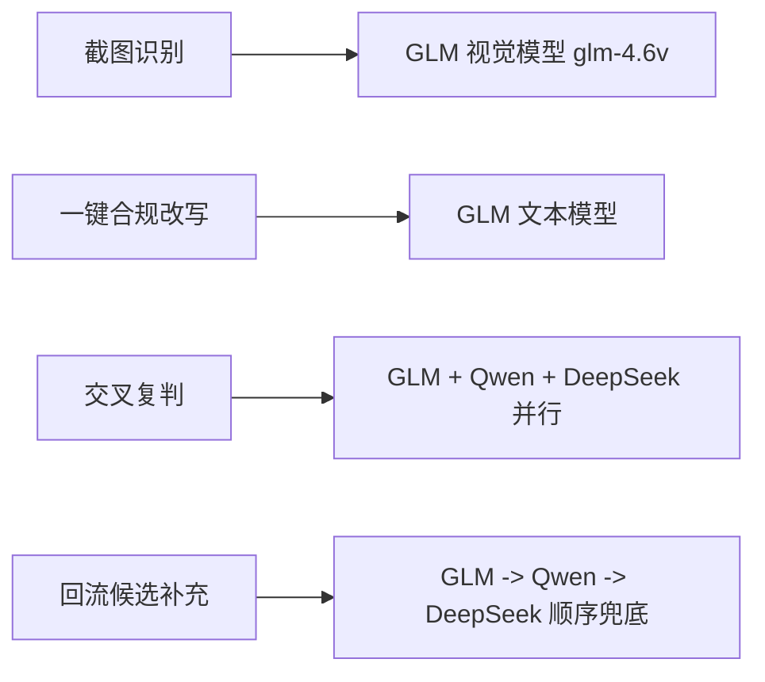
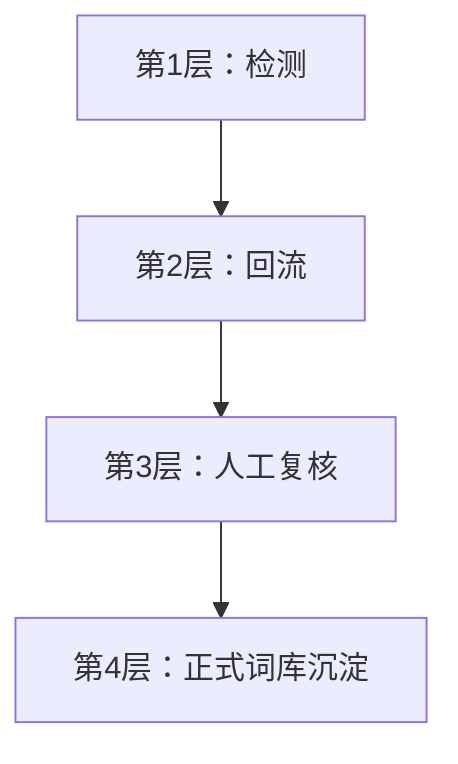

# 系统链路图说明

这份说明的目标只有一个：

让你快速看懂这个项目里，`检测`、`回流`、`复核`、`入库` 到底是怎么串起来的。

## 一句话理解

这个系统本质上分成两条主链路：

1. `内容检测链路`
   你输入一篇笔记，系统判断它当前有没有风险，并可做改写、交叉复判。
2. `违规回流链路`
   你拿到平台真实处罚结果后，把“笔记内容 + 平台原因 + 截图”回流进来，系统再反过来补候选词和语境规则，交给人工复核。

---

## 1. 系统总览图



## 2. 各模块分别负责什么

| 模块 | 作用 |
| --- | --- |
| `src/server.js` | 所有前端请求的统一入口 |
| `src/analyzer.js` | 做本地规则检测 |
| `src/risk-rules.js` | 做组合型语境规则判断 |
| `src/feedback.js` | 做违规回流、候选生成、复核队列整理 |
| `src/glm.js` | 做截图识别、改写、回流候选补充 |
| `src/cross-review.js` | 做多模型交叉复判 |
| `src/admin.js` | 做复核队列转入词库、删除等管理操作 |
| `src/data-store.js` | 负责 JSON 文件读写 |

---

## 3. 内容检测链路

### 3.1 你在页面里点“运行检测”后会发生什么

```mermaid
flowchart TD
    A[输入标题 / 正文 / 封面 / 标签] --> B[/api/analyze]
    B --> C[src/server.js]
    C --> D[analyzePost in analyzer.js]
    D --> E[读取种子词库 + 自定义词库 + 白名单]
    D --> F[执行精确词 / 正则 / 组合语境规则]
    F --> G[输出 verdict / score / hits / suggestions]
    G --> H[前端展示检测结果]
```

### 3.2 这一段的输入输出是什么

- 输入：
  - 标题
  - 正文
  - 封面文案
  - 标签
- 输出：
  - `verdict`：通过 / 观察 / 人工复核 / 高风险拦截
  - `score`：风险分
  - `hits`：命中了哪些规则
  - `suggestions`：怎么改更安全

### 3.3 如果你点“一键合规改写”

```mermaid
flowchart TD
    A[当前笔记内容] --> B[/api/rewrite]
    B --> C[先跑本地检测]
    C --> D[把原文 + 检测结果发给 GLM]
    D --> E[返回改写后的标题 / 正文 / 封面 / 标签]
    E --> F[前端展示改写结果]
```

### 3.4 如果你点“模型交叉复判”

```mermaid
flowchart TD
    A[当前笔记内容] --> B[/api/cross-review]
    B --> C[先跑本地检测]
    C --> D[并行调用 GLM / Qwen / DeepSeek]
    D --> E[汇总各模型复判结论]
    E --> F[前端展示一致 / 分歧情况]
```

---

## 4. 违规原因回流链路

这条链路是现在最容易混淆、也是最重要的一条。

### 4.1 目标

不是简单“记日志”。

而是：

1. 记录平台真实处罚样本
2. 结合笔记内容和平台原因做一次复盘
3. 补出值得人工看的候选词或语境候选
4. 放进复核队列
5. 由人工决定是否正式入库

### 4.2 主流程图

```mermaid
flowchart TD
    A[输入笔记内容 + 平台原因 + 可选截图] --> B[/api/feedback]
    B --> C[src/server.js]

    C --> D{有截图吗}
    D -- 有 --> E[截图识别]
    D -- 无 --> F[直接进入文本回流]

    E --> G[提取平台原因 / 可疑短语]
    G --> F

    F --> H[本地规则检测 analyzePost]
    H --> I[生成 analysisSnapshot]
    I --> J[生成 reviewAudit]

    J --> K[模型补候选]
    K --> L[汇总 suspiciousPhrases + 语境类别]

    L --> M[deriveReviewCandidates]
    M --> N[写入 feedback.log.json]
    M --> O[写入 review-queue.json]
```

---

## 5. 回流链路里每一步到底在干嘛

## 5.1 截图识别

用途：

- 从平台处罚截图里识别出：
  - 平台违规原因原文
  - 截图里直接能看到的可疑短语
  - 一段摘要

当前模型：

- 默认优先用 `GLM_VISION_MODEL`
- 默认值是 `glm-4.6v`

注意：

- 截图识别只负责“看图读信息”
- 它不负责决定是否入库

## 5.2 本地规则复盘

系统会对“被处罚的那条笔记内容”再跑一次本地规则检测，得到：

- `analysisSnapshot`
  - 当前规则对这条笔记的判断快照
- `reviewAudit`
  - 当前规则和平台处罚原因是否一致

`reviewAudit` 主要有三种信号：

| 信号 | 含义 |
| --- | --- |
| `aligned` | 规则判断和平台原因大体一致 |
| `rule_gap` | 平台认为有问题，但本地规则可能漏判 |
| `rule_strict` | 本地规则可能比平台更严，可能有误杀 |

## 5.3 模型补候选

这一步只做“建议”，不直接入库。

当前顺序兜底是：

```text
GLM -> Qwen -> DeepSeek
```

也就是说：

1. 先试 GLM
2. GLM 失败、超时、没配置，再试 Qwen
3. Qwen 再失败，再试 DeepSeek
4. 全失败就退回纯规则链路

模型补的是两类东西：

1. `精确候选短语`
   - 例如：`私信我`、`领取方式`、`完整版`
2. `语境类别`
   - 例如：`导流与私域`
   - 例如：`两性用品宣传与展示`

注意：

- 模型不会直接生成最终词库规则
- 真正的 regex 语境规则，仍然由本地模板生成
- 这样更稳定，也更可控

## 5.4 候选生成

系统会把这些信息合在一起：

- 你手填的 `suspiciousPhrases`
- 截图识别提到的短语
- 模型补充的短语
- 平台原因推断出的类别
- 规则检测命中的类别
- 模型补充的语境类别

然后统一生成两种候选：

1. `精确词候选`
2. `语境候选（regex）`

例如：

- 精确词候选：`私信我`
- 语境候选：`两性用品宣传/展示语境`

## 5.5 平台原因标签拦截

这一步非常关键。

系统会主动拦住这类“看起来像平台原因标签，但不适合作为正式词库词”的内容，比如：

- `两性用品`
- `低俗夸张描述`
- `低俗情景演绎`
- `违规宣传`

也就是说：

- 它们可以作为“处罚原因线索”存在
- 但不会被直接当成精确匹配词入库

## 5.6 写入哪里

回流完成后会写两份数据：

### A. `data/feedback.log.json`

这是“原始回流日志”。

记录的是：

- 笔记内容
- 平台原因
- 截图识别结果
- 模型补充结果
- 规则复盘结果

它的作用是“留证据、留样本”。

### B. `data/review-queue.json`

这是“人工复核队列”。

这里只存真正要你处理的候选项，比如：

- 某个短语要不要入库
- 某个语境 regex 要不要入库

它的作用是“等待人工决定”。

---

## 6. 人工复核队列之后怎么走



### 6.1 “按建议入库”时会发生什么

系统会把候选项转成正式词库草稿：

- 如果是精确词，就生成 `term`
- 如果是语境候选，就生成 `pattern`

然后写入：

- `data/lexicon.custom.json`

### 6.2 为什么一定要人工复核

因为这一步最容易出问题：

- 误把平台原因标签当词
- 模型补了噪音短语
- 某条 regex 太宽，导致误杀

所以当前设计原则是：

`模型可以提建议，但不能直接决定正式规则。`

---

## 7. 当前模型分工图



---

## 8. 你可以把整个系统理解成这四层



对应解释：

### 第 1 层：检测

- 看当前一篇笔记有没有风险

### 第 2 层：回流

- 用平台真实处罚结果，反向补系统盲区

### 第 3 层：人工复核

- 防止脏词、噪音、过宽规则直接污染词库

### 第 4 层：正式沉淀

- 把确认有效的词或语境规则沉淀到自定义词库

---

## 9. 最后用一句最白话的话总结

这个项目不是“一个检测器”。

它更像一个小型闭环系统：

1. 先检测
2. 再拿真实处罚结果回来复盘
3. 再把复盘出的候选交给人工判断
4. 再把确认有效的规则沉淀进词库
5. 下一轮检测就会更准

所以它真正的价值不是“某一次检测准不准”，而是：

`能不能持续把真实违规样本，沉淀成越来越有用的规则。`
